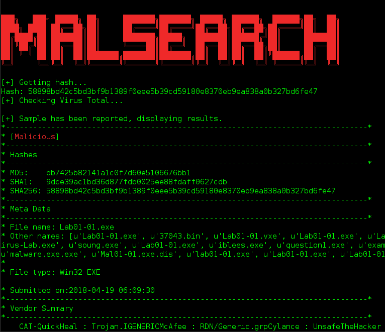

# malsearch

The purpose of this project is to see if a binary is malicious or not by grabbing the hash of the binary and then using Virus Total's public API for any information on the sample(if there is any).

